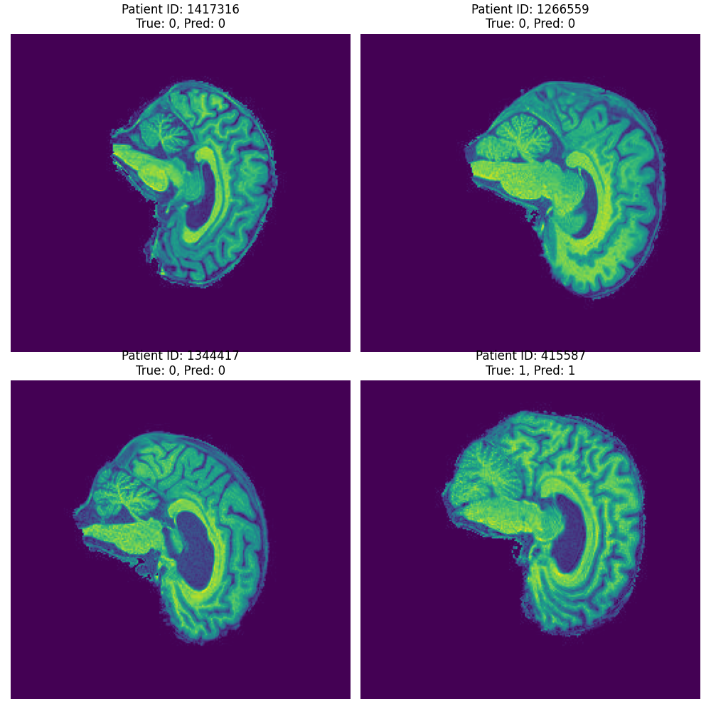
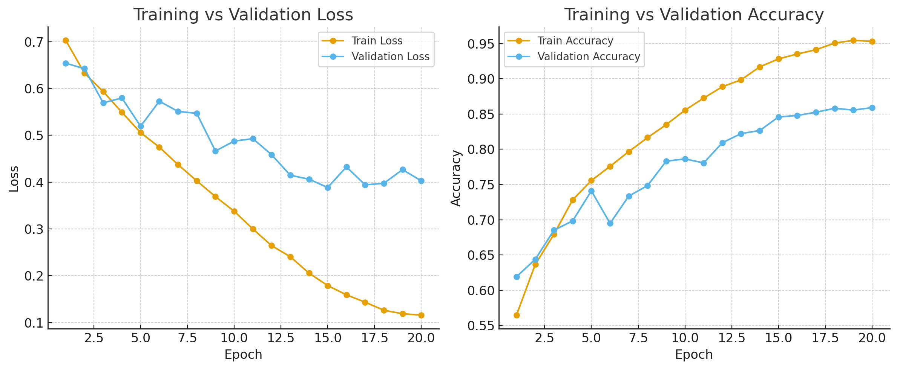

# Alzheimer's Disease Classification with ConvNeXt
**Student ID: s4863083**
This project implements a deep learning pipeline to classify Alzheimer's Disease (AD) versus Normal Control (NC) using 2D MRI slices from the ADNI dataset [2]. The solution implements **ConvNeXt** [1] architecture using PyTorch [3] with 2.5D setting and achieves a **accuracy of 80.22%** on the test set.

## 1. The Problem: Alzheimer's Classification

Alzheimer's disease is a progressive neurodegenerative disorder that is the most common cause of dementia. Early and accurate diagnosis is crucial for patient care and for developing new treatments. This project tackles this problem as a binary image classification task, distinguishing between MRI scans of patients with AD (label `1`) and healthy Normal Control (NC) subjects (label `0`).

## 2. The Algorithm: ConvNeXt

This project uses **ConvNeXt**, a modern convolutional neural network (CNN) architecture introduced by Liu et al. (2022). ConvNeXt is a pure CNN which can compete with modern Vision Transformers (ViTs).

Key architectural features include:
* **Patchify Stem:** Uses a large (4x4) non-overlapping convolution to patchify the input, similar to ViT.
* **Layer Normalization:** Uses `LayerNorm` instead of `BatchNorm` throughout the network.
* **GELU Activation:** Uses the `GELU` activation function instead of `ReLU`.

These changes allow ConvNeXt to achieve state-of-the-art performance on image classification tasks, rivaling and often exceeding transformer-based models.

## 3. Project Pipeline & Methodology

The project works in the following stages:

1.  **Data Preparation (`utils.py`):**
    * extracts all `.jpeg` files from the `dataset/AD_NC/train` and `dataset/AD_NC/test` directories using glob.
    * Assigns labels (`1` for AD, `0` for NC) based on the parent folder.
    * Extracts a `patient_id` from each filename.
    * Saves this information into `train_df.csv` and `test_df.csv`.

2.  **Slice-Stacking Pre-processing (`dataset.py`):**
 This pre-processing step is crucial because standard 2D classification on individual slices fails to capture valuable 3D contextual information. To address this limitation, the TrainDataset class loads three adjacent slices: the current slice (n), the previous slice (n-1), and the next slice (n+1) based on patient_id we use StratifiedGroupKFold to ensure no leak train and validataion dataset remains separate. These three grayscale images are then stacked into a single 3-channel (RGB-like) image, allowing the 2D ConvNet to access spatial context from the z-axis. This 2.5D approach enhances the model’s ability to learn relevant anatomical features. When a neighboring slice is not available such as at the beginning or end of a scan the center slice is duplicated to fill the missing channel.

3.  **Model Training (`train.py`):**
    * The `ConvNext` (Base variant) is trained on the 3-channel stacked slices.
    * The model is trained for 20 epochs using an `AdamW` optimizer and a `CosineAnnealingLR` scheduler.
    * Mixed-precision training (`torch.cuda.amp`) is used to speed up training and reduce memory usage.

4.  **Patient-Level Evaluation:**
    The model’s native output provides a prediction for each individual slice, but to generate a final diagnosis at the patient level, a **majority voting** strategy is applied across all slice predictions. For instance, if a patient has 100 slices and the model predicts “AD” for 70 slices and “NC” for 30 slices, the overall patient-level prediction is “AD.” This voting mechanism ensures that the final diagnosis reflects the dominant pattern across the entire scan rather than relying on a single slice. The logic for this aggregation is implemented in the `calculate_patient_level_accuracy` function.


## 4. Validation Strategy

Proper data splitting is essential to prevent data leakage and ensure the model generalizes.

* **Train/Test Split:** The dataset was pre-split into `train` and `test` directories. This provides a fixed, final test set for evaluation.
* **Train/Validation Split:** We use **`StratifiedGroupKFold`** to create the validation split from the training data.
    * **Stratified:** This ensures that both the training and validation folds contain the same percentage of AD and NC patients. This is vital if the classes are imbalanced.
    * **Group:** This is the most important part. We group the data by `patient_id`. This guarantees that **all slices from a single patient stay in the same fold**.

## 5. Dependencies & Reproducibility

### Dependencies
All required Python packages are listed in the `requirements.txt` file.  
You can install them with:
```bash
pip install -r requirements.txt
```
## 6. Usage

1.  **Clone the repository:**
    ```bash
    git clone https://github.com/gi0nyx/PatternAnalysis-2025.git
    cd PatternAnalysis-2025
    git checkout topic-recognition
    ```


2.  **Organize Data:**
    Place the ADNI dataset into a `dataset/` folder with the following structure:
    ```
    dataset/
    ├── AD_NC/
    │   ├── train/
    │   │   ├── AD/
    │   │   │   ├── patient1_001.jpeg
    │   │   │   ├── patient1_002.jpeg
    │   │   │   └── ...
    │   │   └── NC/
    │   │       ├── patient2_001.jpeg
    │   │       └── ...
    │   └── test/
    │       ├── AD/
    │       │   ├── patient3_001.jpeg
    │       │   └── ...
    │       └── NC/
    │           ├── patient4_001.jpeg
    │           └── ...
    ```

3.  **Create Data CSVs:**
    Run `utils.py` to scan the data folders and create `train_df.csv` and `test_df.csv`.
    ```bash
    python utils.py
    ```

4.  **Train and Evaluate the Model:**
    Run `train.py` to start the training, validation, and final testing process. The script will save the best model weights (`convnext_base_best.pth`) and a CSV of test predictions (`preds.csv`).
    ```bash
    python train.py
    ```

5.  **Visualize Results:**
    After `train.py` has run and created `preds.csv`, run `predict.py` to generate a grid of example predictions.
    ```bash
    python predict.py
    ```
    This will save an image `patient_grid.png`.

## 7. Results & Example Outputs

### Final Test Scores
The model was trained for 20 epochs and evaluated on the hold-out test set. The final model (`convnext_base_best.pth`) achieved the following scores:

* **Test Slice-Level Accuracy:** 0.7520 (75.20%)
* **Test Patient-Level Accuracy (Majority Vote):** 0.8022 

### Example Plots

**Example Patient Predictions:**
This plot (generated by `predict.py`) shows a random sample of patients from the test set, displaying one of their slices, their true label, and the model's final patient-level (majority vote) prediction.



**Training & Validation Curves:**



## 8. References

1. Liu, Zhuang, et al. "A convnet for the 2020s." Proceedings of the IEEE/CVF conference on computer vision and pattern recognition. 2022.
2. Alzheimer's Disease Neuroimaging Initiative (ADNI). [ADNI Dataset.](https://adni.loni.usc.edu)
3. Paszke, Adam, et al. "Pytorch: An imperative style, high-performance deep learning library." Advances in neural information processing systems 32 (2019)
4. Buslaev, Alexander, et al. "Albumentations: fast and flexible image augmentations." Information 11.2 (2020): 125.
